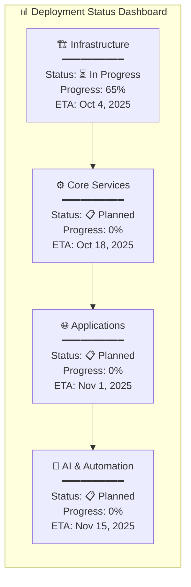

# 🚀 MSDP Modular Deployment Tracker & Milestone Plan

**Version**: 1.0.0  
**Created**: September 20, 2025  
**Purpose**: Comprehensive deployment tracking with milestone-based progress monitoring  
**Status**: 🎯 Planning Phase

---

## 🎯 **Executive Overview**

This modular deployment tracker provides a structured approach to deploying the complete MSDP platform with clear milestones, progress tracking, and automated monitoring. The plan addresses diagram visibility issues while ensuring systematic deployment across all platform components.

---

## 📊 **Deployment Architecture Overview**

### **🏗️ Modular Deployment Strategy**

```mermaid
graph TD
    subgraph "📋 Phase 1: Foundation (Weeks 1-2)"
        F1["🔧 Infrastructure Setup<br/>━━━━━━━━━━━━━━━<br/>• Terraform Infrastructure<br/>• Kubernetes Clusters<br/>• Network Configuration<br/>• DNS & SSL Setup"]
        
        F2["📊 Monitoring Foundation<br/>━━━━━━━━━━━━━━━<br/>• Prometheus Stack<br/>• Grafana Dashboards<br/>• Alert Manager<br/>• Log Aggregation"]
        
        F3["🔐 Security Baseline<br/>━━━━━━━━━━━━━━━<br/>• Cert-Manager<br/>• External-DNS<br/>• RBAC Configuration<br/>• Secret Management"]
    end

    subgraph "⚙️ Phase 2: Core Services (Weeks 3-4)"
        C1["🏢 Backend Microservices<br/>━━━━━━━━━━━━━━━<br/>• User Service (3003)<br/>• Order Service (3006)<br/>• Payment Service (3007)<br/>• Admin Service (3005)"]
        
        C2["🗄️ Database Layer<br/>━━━━━━━━━━━━━━━<br/>• PostgreSQL Clusters<br/>• Redis Cache<br/>• Backup Strategy<br/>• Performance Tuning"]
        
        C3["🔗 API Gateway<br/>━━━━━━━━━━━━━━━<br/>• Rate Limiting<br/>• Authentication<br/>• Load Balancing<br/>• Request Routing"]
    end

    subgraph "🌐 Phase 3: Applications (Weeks 5-6)"
        A1["👥 Customer Applications<br/>━━━━━━━━━━━━━━━<br/>• Web App (4002)<br/>• Mobile App (8090)<br/>• Multi-Country Support<br/>• Performance Optimization"]
        
        A2["👨‍💼 Admin & Merchant<br/>━━━━━━━━━━━━━━━<br/>• Admin Dashboard (4000)<br/>• Merchant Portal (4001)<br/>• Business Analytics<br/>• Operational Tools"]
        
        A3["📍 Location Services<br/>━━━━━━━━━━━━━━━<br/>• Location Service (3001)<br/>• Real-time Tracking<br/>• Geospatial Features<br/>• WebSocket Integration"]
    end

    subgraph "🤖 Phase 4: AI & Automation (Weeks 7-8)"
        AI1["🔄 N8N Workflows<br/>━━━━━━━━━━━━━━━<br/>• Workflow Engine (5678)<br/>• Business Automation<br/>• Process Optimization<br/>• Integration Flows"]
        
        AI2["🧠 AI Agent Integration<br/>━━━━━━━━━━━━━━━<br/>• 6 Specialized Agents<br/>• OpenAI/Claude APIs<br/>• Decision Automation<br/>• Template Generation"]
        
        AI3["🎯 DevOps Automation<br/>━━━━━━━━━━━━━━━<br/>• ArgoCD GitOps<br/>• Crossplane IaC<br/>• Backstage Portal<br/>• CI/CD Pipelines"]
    end

    F1 --> F2 --> F3
    F3 --> C1 --> C2 --> C3
    C3 --> A1 --> A2 --> A3
    A3 --> AI1 --> AI2 --> AI3
```



---

## 🎯 **Milestone-Based Deployment Plan**

### **🏁 Milestone 1: Infrastructure Foundation (Week 1-2)**
**Target Date**: October 4, 2025  
**Success Criteria**: 100% infrastructure operational

#### **Week 1: Core Infrastructure**
- [ ] **Day 1-2**: Terraform infrastructure deployment
  - Azure AKS cluster provisioning
  - Network configuration (VNet, subnets, NSGs)
  - AWS Route53 DNS setup
  - Storage account configuration

- [ ] **Day 3-4**: Kubernetes cluster setup
  - Node pool configuration
  - RBAC setup
  - Ingress controller deployment
  - Load balancer configuration

- [ ] **Day 5**: Security baseline
  - Cert-manager deployment
  - External-DNS configuration
  - SSL certificate automation
  - Secret management setup

#### **Week 2: Monitoring & Observability**
- [ ] **Day 6-7**: Prometheus stack deployment
  - Prometheus server configuration
  - Grafana dashboard setup
  - AlertManager configuration
  - Service discovery setup

- [ ] **Day 8-9**: Logging & tracing
  - ELK stack deployment (optional)
  - Log aggregation configuration
  - Distributed tracing setup
  - Performance monitoring

- [ ] **Day 10**: Validation & testing
  - Infrastructure health checks
  - Monitoring validation
  - Security audit
  - Performance baseline

**📊 Milestone 1 KPIs:**
- ✅ Infrastructure uptime: 99.9%
- ✅ SSL certificates: Auto-issued
- ✅ Monitoring coverage: 100%
- ✅ Security scan: Pass

---

### **🏁 Milestone 2: Core Services (Week 3-4)**
**Target Date**: October 18, 2025  
**Success Criteria**: All backend services operational

#### **Week 3: Database & Cache Layer**
- [ ] **Day 11-12**: PostgreSQL deployment
  - 6 database instances (one per service)
  - High availability configuration
  - Backup strategy implementation
  - Performance tuning

- [ ] **Day 13-14**: Redis cache deployment
  - API gateway cache (6379)
  - Location service cache (6380)
  - Session management
  - Cache optimization

- [ ] **Day 15**: Data layer validation
  - Database connectivity tests
  - Performance benchmarks
  - Backup/restore testing
  - Security validation

#### **Week 4: Backend Microservices**
- [ ] **Day 16-17**: Core services deployment
  - User Service (3003)
  - Order Service (3006)
  - Payment Service (3007)
  - Merchant Service (3002)

- [ ] **Day 18-19**: API Gateway & Admin
  - API Gateway (3000) deployment
  - Admin Service (3005)
  - Rate limiting configuration
  - Authentication setup

- [ ] **Day 20**: Service integration testing
  - Inter-service communication
  - Database connectivity
  - API endpoint validation
  - Performance testing

**📊 Milestone 2 KPIs:**
- ✅ Service uptime: 99.5%
- ✅ API response time: <200ms (p95)
- ✅ Database performance: <50ms queries
- ✅ Integration tests: 100% pass

---

### **🏁 Milestone 3: Frontend Applications (Week 5-6)**
**Target Date**: November 1, 2025  
**Success Criteria**: All user interfaces operational

#### **Week 5: Customer Applications**
- [ ] **Day 21-22**: Customer web application
  - Next.js 15 app deployment (4002)
  - Multi-country configuration
  - Backend API integration
  - Performance optimization

- [ ] **Day 23-24**: Mobile application
  - React Native/Expo app (8090)
  - Cross-platform testing
  - Push notification setup
  - Offline capability

- [ ] **Day 25**: Customer experience validation
  - End-to-end user journey testing
  - Payment flow validation
  - Multi-device testing
  - Performance benchmarks

#### **Week 6: Admin & Business Applications**
- [ ] **Day 26-27**: Admin dashboard
  - Next.js 15 admin app (4000)
  - Role-based access control
  - Business analytics integration
  - Operational dashboards

- [ ] **Day 28-29**: Merchant portal & Location service
  - VendaBuddy frontend (4001)
  - Location Service (3001) deployment
  - Real-time tracking features
  - Geospatial functionality

- [ ] **Day 30**: Application integration testing
  - Cross-application workflows
  - Data consistency validation
  - User experience testing
  - Performance optimization

**📊 Milestone 3 KPIs:**
- ✅ Application uptime: 99.9%
- ✅ Page load time: <2s
- ✅ Mobile performance: 60+ FPS
- ✅ User journey completion: 95%+

---

### **🏁 Milestone 4: AI & Automation (Week 7-8)**
**Target Date**: November 15, 2025  
**Success Criteria**: Full AI-powered automation operational

#### **Week 7: N8N Workflow Engine**
- [ ] **Day 31-32**: N8N deployment
  - Workflow engine setup (5678)
  - Database configuration
  - Security configuration
  - Basic workflow testing

- [ ] **Day 33-34**: Business workflow automation
  - VendaBuddy onboarding workflows
  - Order processing automation
  - Payment processing flows
  - Customer support workflows

- [ ] **Day 35**: Workflow validation
  - End-to-end workflow testing
  - Performance optimization
  - Error handling validation
  - Monitoring setup

#### **Week 8: AI Agent Integration**
- [ ] **Day 36-37**: AI agent deployment
  - 6 specialized AI agents setup
  - OpenAI/Claude API integration
  - Agent workflow configuration
  - Decision automation testing

- [ ] **Day 38-39**: DevOps automation
  - ArgoCD GitOps setup
  - Crossplane deployment
  - Backstage developer portal
  - CI/CD pipeline automation

- [ ] **Day 40**: Full system validation
  - Complete platform testing
  - AI decision validation
  - Automation workflow testing
  - Performance benchmarks

**📊 Milestone 4 KPIs:**
- ✅ Workflow success rate: 99%+
- ✅ AI decision accuracy: 95%+
- ✅ Automation coverage: 80%+
- ✅ Deployment frequency: Daily

---

## 📊 **Deployment Tracking Dashboard**

### **🎯 Real-Time Progress Tracking**



### **📈 Key Performance Indicators (KPIs)**

| Metric | Target | Current | Status |
|--------|---------|---------|--------|
| **Infrastructure Uptime** | 99.9% | - | 🟡 Pending |
| **Service Response Time** | <200ms | - | 🟡 Pending |
| **Application Load Time** | <2s | - | 🟡 Pending |
| **Workflow Success Rate** | 99%+ | - | 🟡 Pending |
| **AI Decision Accuracy** | 95%+ | - | 🟡 Pending |
| **Deployment Frequency** | Daily | - | 🟡 Pending |
| **Security Compliance** | 100% | - | 🟡 Pending |
| **Test Coverage** | 80%+ | - | 🟡 Pending |

---

## 🔧 **Automation & Tooling Framework**

### **🚀 Deployment Automation Tools**

#### **1. Infrastructure as Code**
```bash
# Terraform deployment automation
./deploy-infrastructure.sh --environment=dev --region=uksouth
./validate-infrastructure.sh --check-all
./monitor-deployment.sh --milestone=1
```

#### **2. Application Deployment**
```bash
# Kubernetes deployment with ArgoCD
./deploy-applications.sh --phase=core-services
./run-integration-tests.sh --services=all
./validate-performance.sh --benchmark
```

#### **3. Monitoring & Alerting**
```yaml
# Prometheus alerting rules
groups:
- name: deployment-milestones
  rules:
  - alert: MilestoneDelay
    expr: deployment_milestone_progress < 0.8
    for: 24h
    labels:
      severity: warning
    annotations:
      summary: "Deployment milestone behind schedule"
      
  - alert: ServiceDown
    expr: up{job="msdp-services"} == 0
    for: 5m
    labels:
      severity: critical
    annotations:
      summary: "MSDP service is down"
```

### **📊 Progress Tracking Automation**

#### **Daily Progress Reports**
```javascript
// Automated progress tracking
const generateDailyReport = async () => {
  const milestones = await getMilestoneProgress();
  const kpis = await collectKPIs();
  const issues = await identifyBlockers();
  
  return {
    date: new Date().toISOString(),
    overallProgress: calculateOverallProgress(milestones),
    milestones,
    kpis,
    issues,
    nextActions: generateRecommendations(issues)
  };
};
```

#### **Automated Quality Gates**
```yaml
# GitHub Actions quality gates
quality_gates:
  - name: "Infrastructure Tests"
    threshold: 100%
    blocking: true
    
  - name: "Security Scan"
    threshold: 0_vulnerabilities
    blocking: true
    
  - name: "Performance Tests"
    threshold: "<200ms_p95"
    blocking: false
    
  - name: "Integration Tests"
    threshold: 95%
    blocking: true
```

---

## 🎯 **Risk Management & Mitigation**

### **🚨 Identified Risks & Mitigation Strategies**

| Risk | Impact | Probability | Mitigation Strategy |
|------|---------|-------------|-------------------|
| **Infrastructure Delays** | High | Medium | Parallel deployment, backup cloud regions |
| **Service Integration Issues** | High | Low | Comprehensive testing, staged rollouts |
| **Performance Bottlenecks** | Medium | Medium | Load testing, auto-scaling configuration |
| **Security Vulnerabilities** | High | Low | Continuous security scanning, penetration testing |
| **AI Agent Failures** | Medium | Medium | Fallback mechanisms, human oversight |
| **Data Migration Issues** | High | Low | Backup strategies, rollback procedures |

### **🔄 Rollback Procedures**

#### **Automated Rollback Triggers**
- Service uptime < 95% for 10 minutes
- Error rate > 5% for 5 minutes
- Performance degradation > 50% for 15 minutes
- Security incident detection

#### **Rollback Execution**
```bash
# Automated rollback script
./rollback-deployment.sh --milestone=2 --reason="performance_degradation"
./validate-rollback.sh --check-all-services
./notify-stakeholders.sh --status="rollback_complete"
```

---

## 📅 **Timeline & Resource Allocation**

### **🗓️ Detailed Schedule**

| Week | Phase | Focus Area | Team Allocation | Key Deliverables |
|------|-------|------------|-----------------|------------------|
| **1-2** | Foundation | Infrastructure | DevOps (100%) | Kubernetes cluster, monitoring |
| **3-4** | Core Services | Backend | Backend (80%), DevOps (20%) | Microservices, databases |
| **5-6** | Applications | Frontend | Frontend (80%), Backend (20%) | Web/mobile apps, UX |
| **7-8** | AI & Automation | Integration | Full Team (100%) | N8N workflows, AI agents |

### **👥 Team Responsibilities**

#### **DevOps Team**
- Infrastructure provisioning and management
- Kubernetes cluster administration
- CI/CD pipeline setup and maintenance
- Monitoring and alerting configuration

#### **Backend Team**
- Microservice development and deployment
- Database design and optimization
- API development and documentation
- Integration testing and validation

#### **Frontend Team**
- Web and mobile application development
- User experience optimization
- Cross-platform compatibility
- Performance optimization

#### **AI/Automation Team**
- N8N workflow development
- AI agent integration and training
- Process automation design
- Decision algorithm optimization

---

## 🎉 **Success Criteria & Validation**

### **✅ Final Success Metrics**

#### **Technical Success Criteria**
- [ ] **99.9% Infrastructure Uptime**: All services operational
- [ ] **<200ms API Response Time**: Performance targets met
- [ ] **100% Security Compliance**: All security scans pass
- [ ] **95%+ Test Coverage**: Comprehensive testing complete
- [ ] **Daily Deployments**: CI/CD fully operational

#### **Business Success Criteria**
- [ ] **Complete Customer Journey**: End-to-end functionality
- [ ] **Multi-Country Support**: All 4 countries operational
- [ ] **Real-Time Operations**: Live tracking and updates
- [ ] **AI-Powered Automation**: 80%+ process automation
- [ ] **Scalable Architecture**: Ready for production load

#### **Operational Success Criteria**
- [ ] **Automated Monitoring**: Full observability stack
- [ ] **Self-Healing Systems**: Automated recovery procedures
- [ ] **Documentation Complete**: All systems documented
- [ ] **Team Training Complete**: All teams operational
- [ ] **Disaster Recovery Tested**: Business continuity assured

---

## 📞 **Communication & Reporting**

### **📊 Stakeholder Communication Plan**

#### **Daily Standups** (15 minutes)
- Progress updates from each team
- Blocker identification and resolution
- Next day planning and priorities

#### **Weekly Milestone Reviews** (1 hour)
- Milestone progress assessment
- KPI review and analysis
- Risk assessment and mitigation
- Resource reallocation if needed

#### **Bi-weekly Stakeholder Updates** (30 minutes)
- Executive progress summary
- Budget and timeline updates
- Key achievements and challenges
- Strategic decision requirements

### **📈 Automated Reporting**

#### **Real-Time Dashboard**
- Live deployment status
- Performance metrics
- Error rates and alerts
- Resource utilization

#### **Weekly Reports**
- Milestone progress summary
- KPI trend analysis
- Issue resolution status
- Next week priorities

---

This modular deployment tracker provides a comprehensive framework for systematic MSDP platform deployment with clear milestones, automated tracking, and risk mitigation strategies. The plan ensures visibility, accountability, and successful delivery of the complete platform ecosystem.
