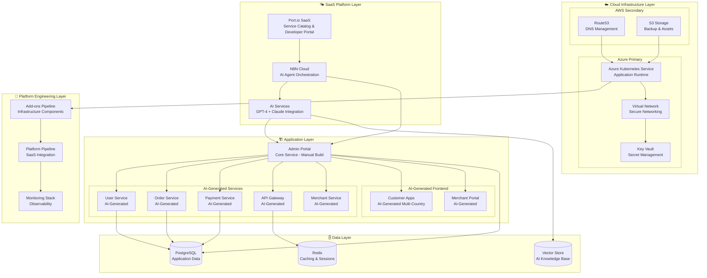
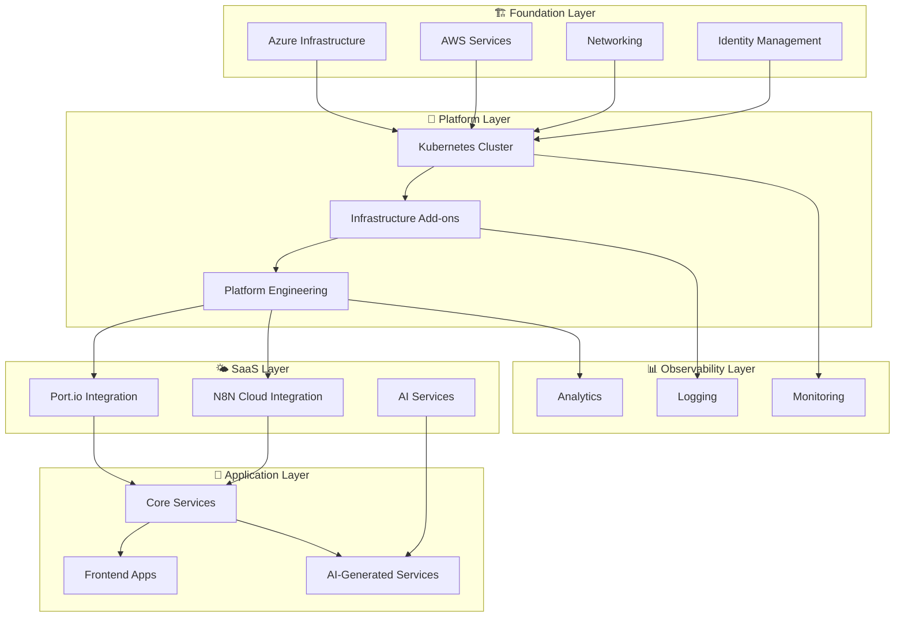
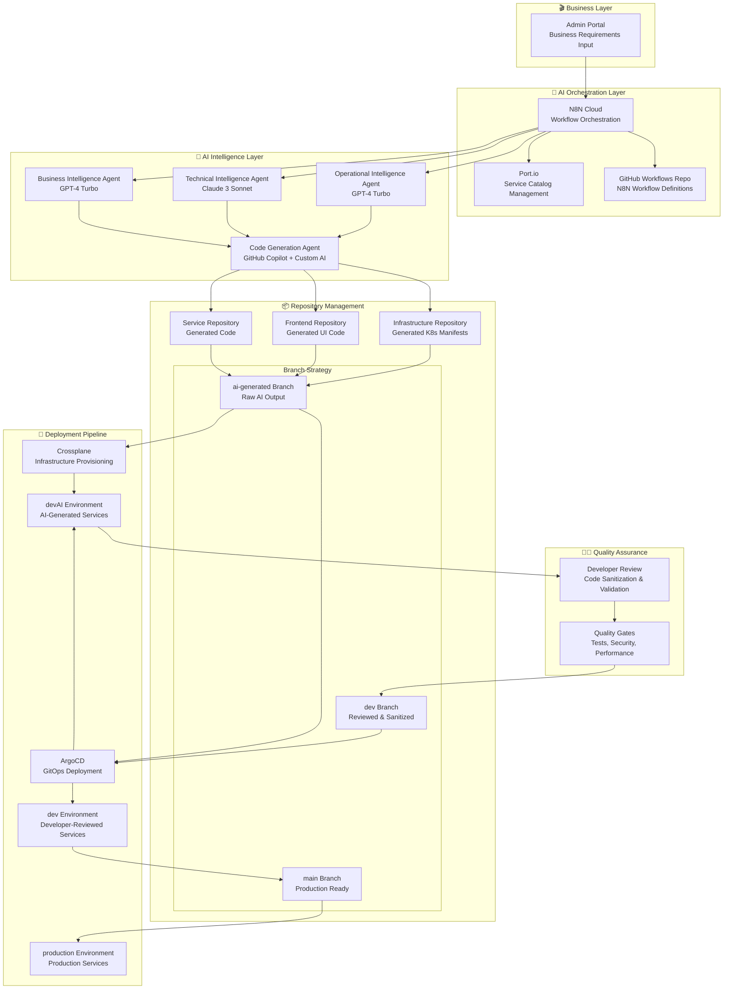
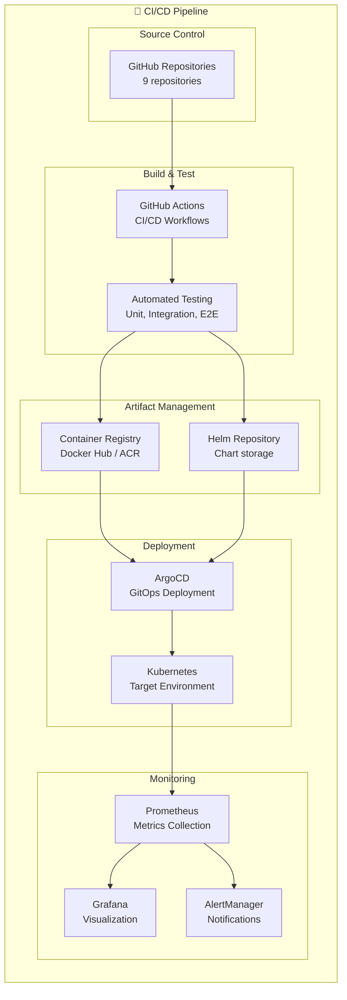
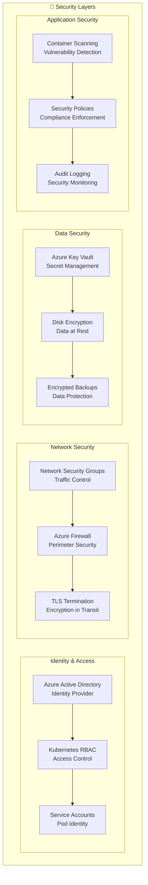

# 🚀 MSDP Master Deployment Guide

**Version**: 1.0.0  
**Last Updated**: September 21, 2025  
**Status**: 🎯 Production Ready  
**Purpose**: Complete deployment guide for MSDP AI-driven service generation platform

> **📋 Prerequisites**: This deployment guide directly implements the architecture defined in the [MSDP Master Technology Overview](./MSDP_MASTER_TECHNOLOGY_OVERVIEW.md). Please review the technology overview first to understand the AI-driven service generation platform architecture.

---

## 🎯 **Executive Summary**

This master deployment guide provides the practical implementation roadmap for the revolutionary **AI-driven service generation ecosystem** described in the MSDP Master Technology Overview. The deployment transforms the architectural vision into a production-ready platform that generates services in **7 minutes** instead of months.

### **Deployment Philosophy (Aligned with Technology Overview)**
- **AI-First Architecture**: Implements the AI agent ecosystem for automated service generation
- **SaaS-Native Deployment**: Deploys Port.io and N8N Cloud integrations as defined in the overview
- **Building Block Methodology**: Realizes the modular architecture with independent deployment capability
- **Geographic Expansion Ready**: Implements the multi-level geographic architecture (country/city/area)
- **Revolutionary Speed**: Achieves the 99.8% faster time-to-market through automated deployment

### **Technology Overview Alignment**
```yaml
Architecture Mapping:
  📋 Technology Overview → 🚀 Deployment Implementation
  
  🤖 AI Agent Ecosystem → Phase 3: SaaS Platform Integration
  🌤️ SaaS-First Architecture → Port.io + N8N Cloud Deployment
  🌐 Frontend Applications → Phase 5: Multi-Platform Frontend Deployment
  🔗 API Management → Phase 4: API Gateway & Service Mesh
  🌍 Geographic Expansion → Multi-Environment & Localization Setup
  📊 Service Portfolio → Service Catalog & Template Management
```

---

## 🏗️ **Architecture-Driven Deployment Framework**

### **Deployment Architecture Overview**


---

## 🧩 **Building Block Architecture**

### **Deployment Building Blocks**
```yaml
Building Block Hierarchy:
  🏗️ Foundation Blocks:
    - Cloud Infrastructure (Azure + AWS)
    - Networking & Security
    - Identity & Access Management
    
  🔧 Platform Blocks:
    - Kubernetes Cluster (AKS)
    - Add-ons Pipeline (Terraform)
    - Platform Engineering Stack
    
  🌤️ SaaS Integration Blocks:
    - Port.io Service Catalog
    - N8N Cloud Workflows
    - AI Service Integration
    
  🚀 Application Blocks:
    - Admin Portal (Manual Build - Core Service)
    - AI-Generated Microservices (User, Order, Payment, API Gateway, Merchant)
    - AI-Generated Frontend Applications (Customer Apps, Merchant Portal)
    
  📊 Observability Blocks:
    - Monitoring & Alerting
    - Logging & Tracing
    - Performance Analytics
```

### **Building Block Dependencies**


---

## 🔄 **AI-Driven Service Generation Flow**

### **Complete End-to-End Workflow**


### **Service Generation Timeline**
```yaml
AI-Driven Generation (7 minutes):
  ⏰ 00:00 - Admin Portal: Business requirements submitted
  ⏰ 00:30 - N8N Cloud: AI agents analyzing requirements  
  ⏰ 02:00 - AI Agents: Code generation in progress
  ⏰ 04:00 - GitHub: Code committed to ai-generated branches
  ⏰ 04:30 - Crossplane: Infrastructure provisioning
  ⏰ 06:00 - ArgoCD: Deploying to devAI environment
  ⏰ 07:00 - ✅ devAI Environment: AI-generated service live!

Developer Review & Promotion (1-3 weeks):
  📧 07:01 - Developer Notification: "Service ready for review"
  👨‍💻 Day 1-2 - Developer Review: Code sanitization and testing
  ✅ Day 3 - Quality Gates: All checks passed
  🚀 Day 3 - dev Environment: Reviewed service deployed
  📊 Week 1-2 - Business Validation: Stakeholder testing
  🌟 Week 3 - production Environment: Service goes live!
```

### **Branch Strategy & Environment Mapping**
```yaml
Repository Branch Strategy:
  ai-generated Branch:
    Purpose: Raw AI-generated code output
    Deployment: devAI environment (automatic)
    Access: https://service-name.devai.aztech-msdp.com
    Duration: 7 minutes (AI generation)
    
  dev Branch:
    Purpose: Developer-reviewed and sanitized code
    Deployment: dev environment (after review)
    Access: https://service-name.dev.aztech-msdp.com
    Duration: 1-3 days (developer review)
    
  main Branch:
    Purpose: Production-ready code
    Deployment: production environment
    Access: https://service-name.aztech-msdp.com
    Duration: 1-3 weeks (business validation)
```

---

## 📋 **Deployment Phases & Roadmap**

### **Phase 1: Foundation Infrastructure (Week 1)**
```yaml
Foundation Deployment:
  🎯 Objectives:
    - Establish cloud infrastructure
    - Setup networking and security
    - Deploy Kubernetes cluster
    - Configure basic monitoring
    
  📦 Components:
    ✅ Azure Resource Group & Networking
    ✅ Azure Kubernetes Service (AKS)
    ✅ AWS Route53 DNS Setup
    ✅ Basic security policies
    ✅ SSL certificate management
    
  🔧 Tools & Scripts:
    - Terraform infrastructure modules
    - GitHub Actions workflows
    - Azure CLI automation
    - AWS CLI configuration
    
  ⏱️ Duration: 3-5 days
  👥 Team: DevOps Engineers
  📊 Success Criteria: AKS cluster operational with basic add-ons
```

### **Phase 2: Platform Engineering Stack (Week 2)**
```yaml
Platform Stack Deployment:
  🎯 Objectives:
    - Deploy infrastructure add-ons
    - Setup monitoring and observability
    - Configure CI/CD pipelines
    - Establish security frameworks
    
  📦 Components:
    ✅ External-DNS (AWS Route53)
    ✅ Cert-Manager (Let's Encrypt)
    ✅ Nginx Ingress Controller
    ✅ Prometheus + Grafana Stack
    ✅ ArgoCD GitOps
    ✅ External Secrets Operator
    ✅ Azure Key Vault CSI Driver
    
  🔧 Deployment Method:
    - Terraform Add-ons Pipeline
    - GitHub Actions automation
    - Helm chart deployments
    - Kubernetes manifests
    
  ⏱️ Duration: 5-7 days
  👥 Team: Platform Engineers
  📊 Success Criteria: Full observability and GitOps operational
```

### **Phase 3: SaaS Platform Integration (Week 3)**
> **📋 Implements**: [AI Agent Ecosystem](./MSDP_MASTER_TECHNOLOGY_OVERVIEW.md#ai-service-generation-workflow) and [SaaS-First Architecture](./MSDP_MASTER_TECHNOLOGY_OVERVIEW.md#saas-first-architecture) from Technology Overview

```yaml
SaaS Integration Deployment:
  🎯 Objectives:
    - Deploy the AI Agent Orchestrator described in Technology Overview
    - Setup Port.io service catalog as the developer portal replacement
    - Configure N8N Cloud workflows for AI agent orchestration
    - Integrate AI services (GPT-4 Turbo + Claude 3 Sonnet)
    - Establish service templates for 7-minute service generation
    
  📦 Components (Technology Overview Alignment):
    ✅ Port.io Workspace Configuration
      → Implements Service Catalog & Discovery from Overview
    ✅ N8N Cloud Workflow Setup
      → Deploys AI Agent Orchestration Platform
    ✅ AI Service Integration (GPT-4, Claude)
      → Realizes Multi-Agent Intelligence System
    ✅ Service Template Library
      → Enables Template-Based Development
    ✅ Webhook Integrations
      → Connects GitHub Repository Automation
    ✅ API Gateway Configuration
      → Implements Intelligent API Gateway System
    
  🔧 Integration Points (Per Technology Overview):
    - Port.io API integration → Service Portfolio Management
    - N8N Cloud webhooks → AI-Driven Service Generation
    - AI service endpoints → Business Intelligence Agents
    - GitHub repository automation → Code Generation Pipeline
    
  ⏱️ Duration: 4-6 days
  👥 Team: Platform Engineers + AI Specialists
  📊 Success Criteria: 7-minute AI service generation operational (Technology Overview KPI)
```

### **Phase 4: Core Application Services (Week 4)**
```yaml
Core Services Deployment:
  🎯 Objectives:
    - Deploy foundational microservices
    - Setup databases and caching
    - Configure service mesh
    - Establish API gateway
    
  📦 Components:
    ✅ API Gateway Service
    ✅ User Management Service
    ✅ Admin Service
    ✅ Merchant Service
    ✅ Order Management Service
    ✅ Payment Processing Service
    ✅ Location & Tracking Service
    ✅ PostgreSQL Databases
    ✅ Redis Caching Layer
    
  🔧 Deployment Strategy:
    - Containerized microservices
    - Kubernetes deployments
    - Service discovery
    - Load balancing
    
  ⏱️ Duration: 5-7 days
  👥 Team: Backend Developers + DevOps
  📊 Success Criteria: All core APIs operational and tested
```

### **Phase 5: Frontend Applications (Week 5)**
> **📋 Implements**: [Frontend Application Ecosystem](./MSDP_MASTER_TECHNOLOGY_OVERVIEW.md#frontend-application-ecosystem) and [Multi-Country Architecture](./MSDP_MASTER_TECHNOLOGY_OVERVIEW.md#multi-country-ai-expansion) from Technology Overview

```yaml
Frontend Deployment:
  🎯 Objectives:
    - Deploy the complete Frontend Application Ecosystem from Technology Overview
    - Setup multi-country applications for geographic expansion capability
    - Configure AI-enhanced frontend generation platform
    - Establish admin portals for AI service generation interface
    
  📦 Components (Technology Overview Alignment):
    ✅ Customer Web Applications (Multi-Country Support):
      - Main App (Port 4002) → Global customer experience
      - USA App (Port 5001) → 🇺🇸 US market localization
      - UK App (Port 5003) → 🇬🇧 UK market localization  
      - India App (Port 5002) → 🇮🇳 India market localization
    ✅ Mobile Application (Port 8090)
      → Cross-platform React Native/Expo implementation
    ✅ Admin Dashboard (Port 4000)
      → AI Service Generation Portal from Technology Overview
    ✅ Merchant Portal (Port 4001)
      → VendaBuddy business operations interface
    ✅ Shared Component Libraries
      → @msdp/ui-components, @msdp/api-client, @msdp/auth
    
  🔧 Deployment Features (Geographic Expansion Ready):
    - Multi-region deployment → Supports country-level expansion
    - CDN integration → Global performance optimization
    - SSL termination → Security compliance (GDPR, etc.)
    - Performance optimization → < 200ms response time KPI
    - AI-generated UI components → Dynamic frontend generation
    
  ⏱️ Duration: 4-6 days
  👥 Team: Frontend Developers + DevOps
  📊 Success Criteria: All frontend apps operational + AI service generation UI ready
```

### **Phase 6: AI Service Generation (Week 6)**
```yaml
AI Platform Activation:
  🎯 Objectives:
    - Activate AI service generation
    - Test end-to-end workflows
    - Validate service templates
    - Enable production readiness
    
  📦 Components:
    ✅ AI Agent Orchestration
    ✅ Service Template Engine
    ✅ Code Generation Pipeline
    ✅ Automated Testing Framework
    ✅ Deployment Automation
    ✅ Monitoring & Alerting
    
  🔧 Validation Process:
    - Generate test services
    - Validate deployment pipeline
    - Test geographic expansion
    - Performance benchmarking
    
  ⏱️ Duration: 3-5 days
  👥 Team: Full Platform Team
  📊 Success Criteria: AI service generation fully operational
```

---

## 🛠️ **Deployment Tools & Automation**

### **Infrastructure as Code Stack**
```yaml
Primary Tools:
  🏗️ Terraform:
    - Infrastructure provisioning
    - Multi-cloud resource management
    - State management and versioning
    - Module-based architecture
    
  ☸️ Kubernetes:
    - Container orchestration
    - Service discovery and load balancing
    - Auto-scaling and self-healing
    - Resource management
    
  📦 Helm:
    - Application packaging
    - Configuration management
    - Release management
    - Template engine
    
  🔄 ArgoCD:
    - GitOps deployment
    - Continuous delivery
    - Application synchronization
    - Rollback capabilities
```

### **CI/CD Pipeline Architecture**


### **Deployment Automation Scripts**
```bash
# Master deployment script structure
msdp-deploy/
├── scripts/
│   ├── 01-foundation-setup.sh      # Cloud infrastructure
│   ├── 02-platform-deploy.sh      # Platform engineering
│   ├── 03-saas-integration.sh     # SaaS platform setup
│   ├── 04-core-services.sh        # Backend services
│   ├── 05-frontend-apps.sh        # Frontend applications
│   ├── 06-ai-activation.sh        # AI service generation
│   └── master-deploy.sh            # Orchestration script
├── terraform/
│   ├── foundation/                 # Infrastructure modules
│   ├── platform/                   # Platform components
│   └── applications/               # Application deployments
├── kubernetes/
│   ├── core-services/              # Backend service manifests
│   ├── frontend-apps/              # Frontend deployments
│   └── monitoring/                 # Observability stack
└── config/
    ├── environments/               # Environment configurations
    ├── secrets/                    # Secret templates
    └── values/                     # Helm values files
```

---

## 🌍 **Multi-Environment Strategy**

### **Environment Architecture**
```yaml
Environment Hierarchy:
  🌍 Production (Multi-Region):
    - Primary: Azure UK South
    - Secondary: Azure Central India
    - DNS: AWS Route53 Global
    - Monitoring: Cross-region
    - Access: https://service-name.aztech-msdp.com
    
  🧪 Staging (Production-like):
    - Location: Azure UK South
    - Purpose: UAT and performance testing
    - Data: Production-like datasets
    - Monitoring: Full observability
    - Access: https://service-name.staging.aztech-msdp.com
    
  🔧 Development (Developer-Reviewed):
    - Location: Azure UK South
    - Purpose: Team collaboration & testing
    - Features: Hot reloading, debugging
    - Monitoring: Development metrics
    - Access: https://service-name.dev.aztech-msdp.com
    
  🤖 devAI (AI-Generated Services):
    - Location: Azure UK South
    - Purpose: AI-generated service validation
    - Features: Raw AI output, rapid iteration
    - Monitoring: Basic health checks
    - Access: https://service-name.devai.aztech-msdp.com
    - Duration: Immediate (7 minutes from AI generation)
    
  💻 Local (Individual):
    - Platform: Docker Desktop / Kind
    - Purpose: Individual development
    - Features: Fast iteration, testing
    - Monitoring: Basic health checks
```

### **Environment-Specific Configurations**
```yaml
Configuration Management:
  📁 Global Configurations:
    - Service catalog definitions
    - AI model configurations
    - Security policies
    - Monitoring templates
    
  🌍 Environment-Specific:
    - Resource sizing
    - Scaling policies
    - Network configurations
    - Secret management
    
  🎯 Application-Specific:
    - Feature flags
    - API endpoints
    - Database connections
    - Cache configurations
```

---

## 🔐 **Security & Compliance Framework**

### **Security Architecture**


### **Compliance Requirements**
```yaml
Regulatory Compliance:
  🇪🇺 GDPR (General Data Protection Regulation):
    - Data privacy controls
    - Right to be forgotten
    - Data portability
    - Consent management
    
  💳 PCI DSS (Payment Card Industry):
    - Secure payment processing
    - Cardholder data protection
    - Network security
    - Regular security testing
    
  🏢 SOC 2 (Service Organization Control):
    - Security controls
    - Availability monitoring
    - Processing integrity
    - Confidentiality measures
    
  🌍 ISO 27001 (Information Security):
    - Information security management
    - Risk assessment
    - Security controls
    - Continuous improvement
```

---

## 📊 **Monitoring & Observability Strategy**

### **Observability Stack**
```yaml
Monitoring Architecture:
  📈 Metrics Collection:
    - Prometheus: Infrastructure and application metrics
    - Custom metrics: Business KPIs and SLIs
    - AI metrics: Service generation performance
    - Cost metrics: Resource utilization tracking
    
  📋 Logging Strategy:
    - Structured logging: JSON format across all services
    - Centralized collection: Fluentd/Fluent Bit
    - Log aggregation: Elasticsearch or Azure Log Analytics
    - Log retention: Compliance-driven retention policies
    
  🔍 Distributed Tracing:
    - Jaeger: Request tracing across microservices
    - OpenTelemetry: Standardized instrumentation
    - Performance analysis: Latency and bottleneck identification
    - AI workflow tracing: Service generation pipeline visibility
    
  🚨 Alerting Framework:
    - AlertManager: Prometheus-based alerting
    - Multi-channel notifications: Slack, email, PagerDuty
    - Escalation policies: Severity-based routing
    - Runbook automation: Self-healing capabilities
```

### **Key Performance Indicators (KPIs)**
> **📋 Aligned with**: [Business Value Transformation](./MSDP_MASTER_TECHNOLOGY_OVERVIEW.md#business-value-transformation) metrics from Technology Overview

```yaml
Platform KPIs (Technology Overview Alignment):
  ⚡ Performance Metrics:
    - API Response Time: < 200ms (p95) → Technology Overview standard
    - Service Availability: 99.9% uptime → Enterprise-grade reliability
    - AI Service Generation: < 7 minutes end-to-end → Revolutionary speed metric
    - Database Query Performance: < 50ms (p95) → High-performance data access
    
  🎯 Business Metrics (Technology Overview KPIs):
    - Time to Market: 7 minutes (vs 2-6 months) → 99.8% faster
    - Cost per Service: $55 (vs $40,200) → 99.86% cost reduction
    - Service Generation Success Rate: > 95% → AI reliability target
    - Developer Productivity: 10x improvement → Revolutionary efficiency
    
  🌍 Geographic Expansion Metrics (Technology Overview):
    - Market Entry Time: 7 minutes → Instant global expansion
    - Cultural Accuracy: 95%+ → AI localization quality
    - Compliance Validation: 30 seconds → Automated regulatory compliance
    - Local Market Fit: 90%+ → AI market analysis accuracy
    
  🔒 Security Metrics:
    - Security Scan Coverage: 100% of containers
    - Vulnerability Remediation: < 24 hours (critical)
    - Compliance Score: > 95% (GDPR, PCI DSS, SOC 2)
    - Security Incident Response: < 1 hour
    
  💰 Cost Metrics (Technology Overview ROI):
    - Infrastructure Cost Reduction: 94% (SaaS-first approach)
    - Monthly Savings: $9,400 → Technology Overview calculation
    - Annual Savings: $112,800 → Technology Overview projection
    - ROI Achievement: 300% faster than traditional
```

---

## 🚀 **Deployment Execution Guide**

### **Pre-Deployment Checklist**
```yaml
Prerequisites Validation:
  ☑️ Cloud Accounts:
    - Azure subscription with appropriate permissions
    - AWS account for Route53 and S3 services
    - Service principal credentials configured
    - Billing alerts and cost management setup
    
  ☑️ Development Environment:
    - Terraform >= 1.9 installed
    - Azure CLI authenticated
    - AWS CLI configured
    - kubectl configured
    - Helm >= 3.0 installed
    
  ☑️ Repository Access:
    - GitHub organization access
    - Repository permissions configured
    - SSH keys or personal access tokens
    - Branch protection rules understood
    
  ☑️ SaaS Platform Access:
    - Port.io workspace created
    - N8N Cloud account setup
    - AI service API keys obtained
    - Integration webhooks configured
```

### **Deployment Execution Steps**
```bash
# Master deployment execution
#!/bin/bash

echo "🚀 MSDP Master Deployment Starting..."

# Phase 1: Foundation Infrastructure
echo "📋 Phase 1: Deploying Foundation Infrastructure"
./scripts/01-foundation-setup.sh
if [ $? -ne 0 ]; then
    echo "❌ Foundation setup failed. Aborting deployment."
    exit 1
fi

# Phase 2: Platform Engineering Stack
echo "📋 Phase 2: Deploying Platform Engineering Stack"
./scripts/02-platform-deploy.sh
if [ $? -ne 0 ]; then
    echo "❌ Platform deployment failed. Aborting deployment."
    exit 1
fi

# Phase 3: SaaS Platform Integration
echo "📋 Phase 3: Integrating SaaS Platforms"
./scripts/03-saas-integration.sh
if [ $? -ne 0 ]; then
    echo "❌ SaaS integration failed. Aborting deployment."
    exit 1
fi

# Phase 4: Core Application Services
echo "📋 Phase 4: Deploying Core Services"
./scripts/04-core-services.sh
if [ $? -ne 0 ]; then
    echo "❌ Core services deployment failed. Aborting deployment."
    exit 1
fi

# Phase 5: Frontend Applications
echo "📋 Phase 5: Deploying Frontend Applications"
./scripts/05-frontend-apps.sh
if [ $? -ne 0 ]; then
    echo "❌ Frontend deployment failed. Aborting deployment."
    exit 1
fi

# Phase 6: AI Service Generation Activation
echo "📋 Phase 6: Activating AI Service Generation"
./scripts/06-ai-activation.sh
if [ $? -ne 0 ]; then
    echo "❌ AI activation failed. Aborting deployment."
    exit 1
fi

echo "✅ MSDP Master Deployment Completed Successfully!"
echo "🌐 Platform accessible at: https://dashboard.dev.aztech-msdp.com"
echo "📊 Monitoring available at: https://grafana.dev.aztech-msdp.com"
echo "🔧 Service catalog at: https://port.io/your-workspace"
```

### **Post-Deployment Validation**
```yaml
Validation Checklist:
  🔍 Infrastructure Validation:
    - AKS cluster health check
    - Node pool status verification
    - Network connectivity testing
    - DNS resolution validation
    
  🔧 Platform Component Validation:
    - All add-ons running and healthy
    - SSL certificates issued and valid
    - Monitoring stack operational
    - GitOps synchronization working
    
  🌤️ SaaS Integration Validation:
    - Port.io service catalog populated
    - N8N workflows active and responsive
    - AI services responding to requests
    - Webhook integrations functional
    
  🚀 Application Validation:
    - All core services healthy and responsive
    - Frontend applications loading correctly
    - Database connections established
    - API endpoints returning expected responses
    
  🤖 AI Platform Validation:
    - Generate a test service successfully
    - Validate end-to-end service creation
    - Test geographic expansion capability
    - Verify monitoring and alerting
```

---

## 🔄 **Maintenance & Operations**

### **Operational Procedures**
```yaml
Daily Operations:
  📊 Health Monitoring:
    - Review Grafana dashboards
    - Check alert status and resolution
    - Validate backup completion
    - Monitor cost and resource usage
    
  🔧 Platform Maintenance:
    - Review ArgoCD sync status
    - Check certificate expiration dates
    - Validate security scan results
    - Update dependency versions
    
  🤖 AI Platform Operations:
    - Monitor service generation metrics
    - Review AI agent performance
    - Validate template library updates
    - Check SaaS platform status
```

### **Disaster Recovery Strategy**
```yaml
Disaster Recovery Plan:
  🚨 Recovery Time Objectives (RTO):
    - Critical services: 15 minutes
    - Full platform: 1 hour
    - Data recovery: 4 hours
    - Complete rebuild: 8 hours
    
  💾 Backup Strategy:
    - Database backups: Every 6 hours
    - Configuration backups: Daily
    - Infrastructure state: Continuous
    - Application data: Real-time replication
    
  🔄 Recovery Procedures:
    - Automated failover for critical services
    - Multi-region deployment capability
    - Infrastructure as Code rebuild
    - Data restoration from backups
```

---

## 📚 **Documentation & Resources**

### **Deployment Documentation**
- **Infrastructure Documentation**: Terraform module documentation
- **Application Documentation**: Service API documentation and deployment guides
- **Operational Runbooks**: Step-by-step operational procedures
- **Troubleshooting Guides**: Common issues and resolution steps
- **Security Procedures**: Security incident response and compliance guides

### **Training & Knowledge Transfer**
- **Platform Engineering Training**: Infrastructure and deployment procedures
- **Developer Onboarding**: Application development and deployment workflows
- **Operations Training**: Monitoring, alerting, and incident response
- **AI Platform Training**: Service generation and template management

---

## 📋 **Technology Overview Cross-Reference**

### **Complete Architecture Alignment**
```yaml
Technology Overview Section → Deployment Implementation:

🤖 AI Service Generation Workflow → Phase 3: SaaS Platform Integration
  - AI Agent Orchestrator → N8N Cloud deployment
  - Business Intelligence Agents → AI service integration
  - Code Generation Pipeline → GitHub automation setup

🌤️ SaaS-First Architecture → Phase 3: SaaS Platform Integration  
  - Port.io SaaS → Service catalog deployment
  - N8N Cloud → Workflow automation setup
  - Zero maintenance overhead → SaaS configuration

🌐 Frontend Application Ecosystem → Phase 5: Frontend Applications
  - Multi-Country Web Apps → Geographic deployment strategy
  - Mobile Applications → Cross-platform deployment
  - Admin Dashboard → AI service generation portal

🔗 API Management & Gateway → Phase 4: Core Application Services
  - Intelligent API Gateway → API gateway deployment
  - Multi-channel routing → Service mesh configuration
  - Performance optimization → Load balancing setup

🌍 Geographic Expansion Engine → Multi-Environment Strategy
  - Country-level expansion → Multi-region deployment
  - City-level deployment → Environment configurations
  - Area-specific services → Localization setup

📊 Service Portfolio Management → Phase 6: AI Platform Activation
  - Service catalog integration → Port.io configuration
  - Template management → Service template library
  - Governance framework → Automated quality gates

💰 Business Value Transformation → KPI Monitoring & Measurement
  - 99.8% faster time-to-market → 7-minute deployment validation
  - 99.86% cost reduction → Cost optimization metrics
  - Revolutionary ROI → Performance measurement framework
```

### **Success Validation Checklist**
```yaml
Technology Overview Promise → Deployment Validation:

✅ 7-Minute Service Generation:
  - AI agents operational → Phase 3 completion
  - Template library ready → Phase 6 validation
  - End-to-end workflow tested → Final validation

✅ Geographic Expansion Ready:
  - Multi-environment setup → Environment strategy
  - Localization framework → Configuration management
  - Cultural adaptation → AI service integration

✅ SaaS-First Benefits Realized:
  - 94% infrastructure cost reduction → Cost metrics
  - Zero maintenance overhead → SaaS deployment
  - Automatic updates → Managed service benefits

✅ AI-Native Platform Operational:
  - Service generation working → AI platform activation
  - Business requirements → Service deployment
  - Developer validation → Quality assurance
```

---

**🎯 This Master Deployment Guide provides the complete implementation roadmap for the revolutionary AI-driven service generation platform described in the [MSDP Master Technology Overview](./MSDP_MASTER_TECHNOLOGY_OVERVIEW.md). Together, these documents form the complete blueprint for transforming business ideas into production services in 7 minutes through intelligent automation and enterprise-grade infrastructure.**
