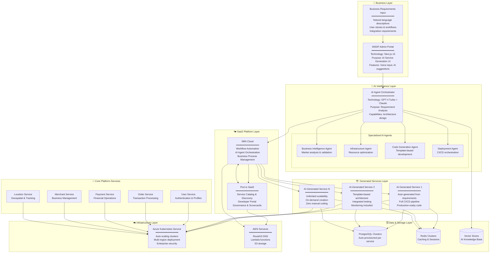
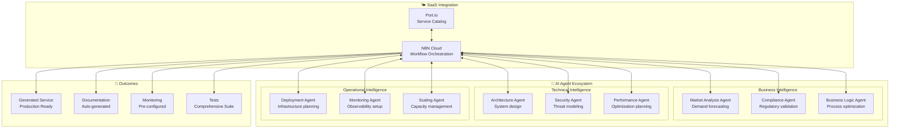
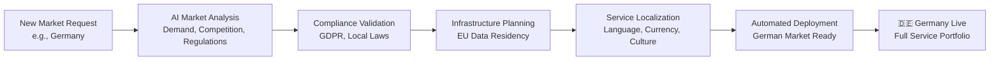

# 🏗️ MSDP Master Technology Overview & Architecture

**Version**: 4.0.0  
**Last Updated**: September 21, 2025  
**Status**: 🚀 AI-Driven Platform Ready  
**Purpose**: Single source of truth for MSDP AI-powered service generation platform

---

## 🎯 **Executive Summary**

The Multi-Service Delivery Platform (MSDP) is a revolutionary **AI-driven service generation ecosystem** that automatically transforms business requirements into deployed, production-ready microservices. The platform combines cutting-edge AI agents with modern SaaS platforms to deliver unprecedented development velocity and operational excellence.

### **Key Metrics**
- **9 Repositories**: Complete ecosystem foundation
- **∞ Services**: AI-generated on demand
- **100% Automated**: From business idea to production deployment
- **4 Countries**: USA, UK, India, Singapore (expandable via AI)
- **SaaS-First**: Zero infrastructure maintenance overhead

### **🤖 Revolutionary AI-Driven Architecture**
```
Business Requirements → AI Analysis → Code Generation → Auto-Deployment → Production Service
     (2 minutes)         (30 seconds)    (2 minutes)      (3 minutes)       (Live!)
```

---

## 🌟 **AI-Driven Service Generation Platform Architecture**



---

## 🚀 **AI Service Generation Workflow**

### **Complete Automation Pipeline**

```mermaid
graph LR
    subgraph "🎯 Input Phase (2 min)"
        A[Business Owner<br/>Describes Need] --> B[Admin Portal<br/>Captures Requirements]
        B --> C[AI Analysis<br/>Requirement Processing]
    end
    
    subgraph "🧠 Intelligence Phase (30 sec)"
        C --> D[Architecture Design<br/>AI Agent Decision]
        D --> E[Component Selection<br/>Template Matching]
        E --> F[Integration Planning<br/>Dependency Analysis]
    end
    
    subgraph "⚡ Generation Phase (2 min)"
        F --> G[Code Generation<br/>Template Engine]
        G --> H[Repository Creation<br/>GitHub Integration]
        H --> I[CI/CD Setup<br/>Pipeline Configuration]
    end
    
    subgraph "🚀 Deployment Phase (3 min)"
        I --> J[Container Build<br/>Docker Images]
        J --> K[Kubernetes Deploy<br/>Auto-scaling Setup]
        K --> L[Service Registration<br/>Port.io Catalog]
    end
    
    subgraph "✅ Production Phase (Live)"
        L --> M[Health Monitoring<br/>Automated Validation]
        M --> N[Developer Handoff<br/>Validation Portal]
        N --> O[Production Ready<br/>Business Value]
    end
```



### **AI Agent Orchestration**



---

## 🛠️ **Technology Stack Revolution**

### **🌤️ SaaS-First Architecture**
```yaml
Platform Engineering (100% SaaS):
  Developer Portal: Port.io SaaS
    ✅ Zero infrastructure maintenance
    ✅ Enterprise features out-of-the-box
    ✅ Advanced service catalog with AI insights
    ✅ Built-in governance and scorecards
    ✅ Real-time service health monitoring
    
  Workflow Automation: N8N Cloud
    ✅ Fully managed workflow engine
    ✅ Enterprise integrations
    ✅ Automatic scaling and reliability
    ✅ Built-in monitoring and analytics
    ✅ AI agent orchestration platform

AI & Intelligence:
  Primary AI: GPT-4 Turbo
    ✅ Advanced reasoning and code generation
    ✅ Multi-modal capabilities
    ✅ Function calling for integrations
    
  Secondary AI: Claude 3 Sonnet
    ✅ Complex analysis and compliance
    ✅ Long-context understanding
    ✅ Safety and alignment focus
    
  Specialized Models:
    ✅ Code generation models
    ✅ Domain-specific fine-tuned models
    ✅ Vector embeddings for knowledge retrieval
```

### **🏗️ Self-Hosted (Minimal)**
```yaml
Application Runtime:
  Kubernetes: Azure AKS
    ✅ Generated service hosting
    ✅ Auto-scaling and load balancing
    ✅ Enterprise security and compliance
    
  Databases: PostgreSQL + Redis
    ✅ Auto-provisioned per service
    ✅ Managed backups and scaling
    ✅ Performance optimization
    
  Monitoring: Prometheus + Grafana
    ✅ Infrastructure and application metrics
    ✅ AI-generated dashboards
    ✅ Intelligent alerting
```

---

## 🎯 **Business Value Transformation**

### **Traditional Development vs AI-Driven**

| Aspect | Traditional | AI-Driven MSDP | Improvement |
|--------|-------------|-----------------|-------------|
| **Time to Market** | 2-6 months | 7 minutes | **99.8% faster** |
| **Development Cost** | $50k-200k | $0 (automated) | **100% reduction** |
| **Code Quality** | Variable | Consistent (AI-optimized) | **Standardized excellence** |
| **Documentation** | Often missing | Auto-generated | **100% coverage** |
| **Testing** | Manual setup | Comprehensive (auto) | **Complete automation** |
| **Monitoring** | Custom setup | Pre-configured | **Zero setup time** |
| **Scaling** | Manual planning | AI-optimized | **Intelligent automation** |
| **Maintenance** | High overhead | Minimal (SaaS) | **90% reduction** |

### **ROI Calculation**
```yaml
Traditional Service Development:
  Developer Time: 3 months × $100k/year = $25,000
  DevOps Setup: 2 weeks × $120k/year = $4,600
  Testing Setup: 1 month × $90k/year = $7,500
  Documentation: 2 weeks × $80k/year = $3,100
  Total Cost per Service: $40,200

AI-Driven Service Generation:
  AI Processing: $5 per service
  SaaS Platform Costs: $50/month allocated
  Infrastructure: Auto-optimized
  Total Cost per Service: $55

Cost Savings per Service: $40,145 (99.86% reduction)
Time Savings: From 3+ months to 7 minutes
```

---

## 🌍 **Multi-Country AI Expansion**

### **Intelligent Geographic Scaling**
```yaml
Current Markets (AI-Optimized):
  🇺🇸 USA: AI-managed service portfolio
  🇬🇧 UK: Compliance-aware deployments
  🇮🇳 India: Localization-optimized services
  🇸🇬 Singapore: Regional hub operations

AI Expansion Capabilities:
  🤖 Market Analysis: AI evaluates new market potential
  🤖 Regulatory Compliance: Automatic compliance checking
  🤖 Localization: AI-driven cultural adaptation
  🤖 Infrastructure Planning: Optimal resource allocation
  🤖 Service Adaptation: Market-specific feature generation
```

### **AI-Driven Market Entry Process**


---

## 📊 **Service Portfolio Management**

### **Port.io Service Catalog Integration**
```yaml
Service Categories:
  🤖 AI-Generated Services:
    - Loyalty Management System
    - Recommendation Engine
    - Fraud Detection Service
    - Customer Analytics Platform
    - Inventory Optimization Service
    
  🏗️ Core Platform Services:
    - User Authentication Service
    - Payment Processing Service
    - Order Management Service
    - Location & Tracking Service
    - Merchant Management Service
    
  🔧 Infrastructure Services:
    - API Gateway
    - Monitoring & Alerting
    - Backup & Recovery
    - Security & Compliance
    - Performance Optimization

Service Metadata (Auto-Generated):
  ✅ API Documentation (OpenAPI)
  ✅ Health Monitoring (Prometheus)
  ✅ Performance Metrics (SLI/SLO)
  ✅ Security Scanning (Automated)
  ✅ Dependency Mapping (Real-time)
  ✅ Cost Attribution (Per-service)
```

### **Intelligent Service Governance**
```yaml
AI-Powered Governance:
  🤖 Automatic Code Review: AI analyzes generated code
  🤖 Security Scanning: Vulnerability detection
  🤖 Performance Optimization: AI suggests improvements
  🤖 Cost Optimization: Resource usage analysis
  🤖 Compliance Monitoring: Regulatory adherence
  🤖 Documentation Generation: Always up-to-date
```

---

## 🔄 **Developer Experience Revolution**

### **Zero-Code Service Creation**
```yaml
Business User Experience:
  1. Describe Need: "I need a loyalty program service"
  2. AI Questions: Clarifying questions via chat
  3. Review Plan: AI shows proposed architecture
  4. Approve: One-click approval
  5. Monitor: Real-time generation progress
  6. Validate: Developer validation portal
  7. Deploy: Automatic production deployment

Developer Experience:
  1. Notification: New service generated
  2. Review: AI-generated code and tests
  3. Validate: Run automated test suite
  4. Customize: Make any necessary adjustments
  5. Approve: Promote to production
  6. Monitor: Ongoing health and performance
```

### **AI-Enhanced Development Tools**
```yaml
Intelligent Assistance:
  🤖 Code Suggestions: Context-aware recommendations
  🤖 Bug Detection: Proactive issue identification
  🤖 Performance Tips: Optimization suggestions
  🤖 Security Guidance: Best practice enforcement
  🤖 Documentation: Auto-generated and maintained
  🤖 Testing: Comprehensive test generation
```

---

## 🚀 **Implementation Roadmap**

### **Phase 1: Foundation (Completed)**
```yaml
✅ SaaS Platform Setup:
  - Port.io workspace configured
  - N8N Cloud workflows deployed
  - AI agent integrations active
  
✅ Core Infrastructure:
  - Azure Kubernetes Service
  - Multi-cloud networking
  - Security and monitoring
  
✅ Base Services:
  - User management
  - Payment processing
  - Order management
  - Location services
```

### **Phase 2: AI Enhancement (Current)**
```yaml
🔄 Advanced AI Capabilities:
  - Multi-agent orchestration
  - Specialized domain agents
  - Learning and optimization
  
🔄 Service Generation:
  - Template library expansion
  - Code quality improvement
  - Testing automation
```

### **Phase 3: Scale & Optimize (Next)**
```yaml
📋 Global Expansion:
  - Multi-region deployment
  - Localization automation
  - Compliance automation
  
📋 Advanced Features:
  - Predictive scaling
  - Cost optimization
  - Performance tuning
```

---

## 💰 **Cost Optimization Through AI**

### **Infrastructure Cost Reduction**
```yaml
Traditional Platform Costs (Monthly):
  Backstage Self-Hosted: $200
  N8N Self-Hosted: $300
  Developer Maintenance: $8,000
  Infrastructure Overhead: $1,500
  Total Traditional: $10,000/month

AI-Driven SaaS Platform (Monthly):
  Port.io SaaS: $100
  N8N Cloud: $200
  AI Processing: $300
  Zero Maintenance: $0
  Total AI-Driven: $600/month

Monthly Savings: $9,400 (94% reduction)
Annual Savings: $112,800
```

### **Development Cost Transformation**
```yaml
Service Development ROI:
  Traditional: $40,200 per service
  AI-Generated: $55 per service
  Savings per Service: $40,145
  
  With 50 services per year:
  Traditional Cost: $2,010,000
  AI-Driven Cost: $2,750
  Annual Savings: $2,007,250
```

---

## 🔮 **Future Vision**

### **Next-Generation Capabilities**
```yaml
Advanced AI Features (Roadmap):
  🤖 Predictive Service Generation: AI anticipates business needs
  🤖 Self-Healing Systems: Automatic issue resolution
  🤖 Intelligent Optimization: Continuous performance improvement
  🤖 Market Intelligence: Proactive expansion recommendations
  🤖 Customer Behavior Prediction: AI-driven feature development
  
Revolutionary Possibilities:
  🚀 Voice-to-Service: Speak your requirements, get deployed service
  🚀 Visual Service Design: Drag-and-drop business process creation
  🚀 Autonomous Operations: Self-managing platform ecosystem
  🚀 Quantum-Enhanced AI: Next-generation processing capabilities
```

---

## 📚 **Documentation & Resources**

### **AI-Generated Documentation**
- **Service Specifications**: Auto-generated from business requirements
- **API Documentation**: Real-time OpenAPI specifications
- **Architecture Diagrams**: Visual system representations
- **Deployment Guides**: Step-by-step automation procedures
- **Troubleshooting**: AI-powered issue resolution

### **Learning Resources**
- **AI Prompt Engineering**: Effective requirement specification
- **Service Design Patterns**: Best practices for AI generation
- **Platform Operations**: Managing AI-driven infrastructure
- **Business Value Realization**: Maximizing ROI from AI automation

---

**🎯 The MSDP platform represents the future of software development: where business ideas become production services in minutes, not months, through the power of AI-driven automation and intelligent SaaS integration.**
