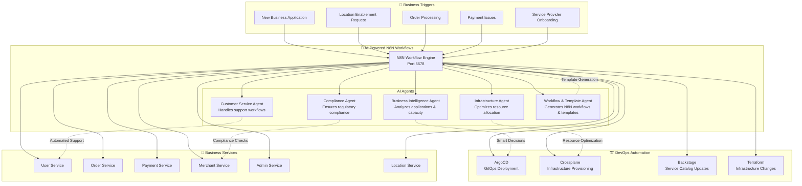
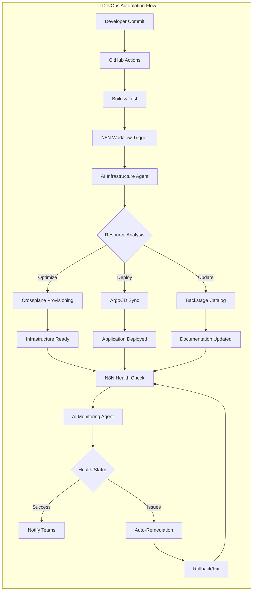
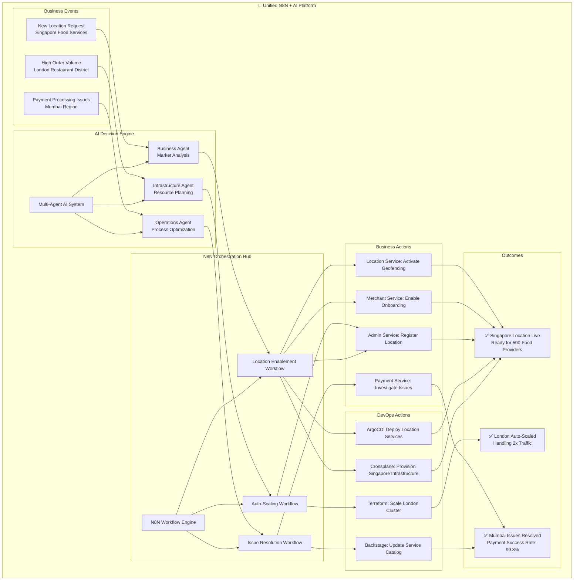
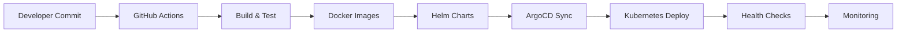
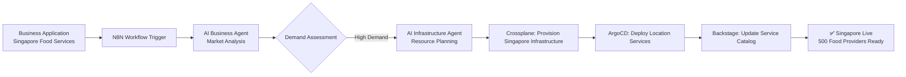
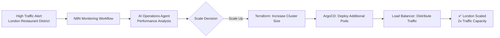

# 🏗️ MSDP Master Technology Overview & Architecture

**Version**: 3.0.0  
**Last Updated**: September 20, 2025  
**Status**: ✅ Production Ready  
**Purpose**: Single source of truth for all MSDP technology, tools, and architecture

---

## 🎯 **Executive Summary**

The Multi-Service Delivery Platform (MSDP) is a complete, production-ready microservice ecosystem supporting VendaBuddy business operations across multiple countries. The platform combines modern cloud-native technologies with enterprise-grade DevOps practices.

### **Key Metrics**
- **9 Repositories**: Complete ecosystem
- **15+ Applications**: Web, mobile, admin interfaces
- **7 Microservices**: 100% containerized
- **4 Countries**: USA, UK, India, Singapore
- **Multi-Cloud**: Azure (primary), AWS (secondary)

---

## 🌐 **Complete Technology Stack & Flowchart**

```mermaid
graph TB
    subgraph "👥 User Layer"
        CW[Customer Web Apps<br/>Next.js 15]
        CM[Customer Mobile<br/>React Native/Expo]
        MW[Merchant Portal<br/>VendaBuddy]
        AD[Admin Dashboard<br/>Platform Management]
    end

    subgraph "🌐 API & Gateway Layer"
        AG[API Gateway<br/>Port 3000<br/>Rate Limiting & Auth]
    end

    subgraph "🔄 Workflow Automation & AI Layer"
        N8N[N8N Workflows<br/>Business Process Automation<br/>Replaces Flowable]
        AI[AI Agents<br/>OpenAI/Claude Integration<br/>Intelligent Decision Making]
        N8N <--> AI
    end

    subgraph "🏗️ Microservices Layer"
        US[User Service<br/>Port 3003<br/>Auth & Profiles]
        OS[Order Service<br/>Port 3006<br/>Cart & Orders]
        PS[Payment Service<br/>Port 3007<br/>Transactions]
        MS[Merchant Service<br/>Port 3002<br/>Business Mgmt]
        AS[Admin Service<br/>Port 3005<br/>Platform Ops]
        LS[Location Service<br/>Port 3001<br/>Geospatial & Tracking]
    end

    subgraph "🗄️ Data Layer"
        PG1[(PostgreSQL<br/>User DB)]
        PG2[(PostgreSQL<br/>Order DB)]
        PG3[(PostgreSQL<br/>Payment DB)]
        PG4[(PostgreSQL<br/>Merchant DB)]
        PG5[(PostgreSQL<br/>Admin DB)]
        PG6[(PostgreSQL<br/>Location DB)]
        RD1[(Redis<br/>API Cache)]
        RD2[(Redis<br/>Location Cache)]
    end

    subgraph "🚀 DevOps & Infrastructure"
        TF[Terraform<br/>Infrastructure as Code]
        K8S[Kubernetes<br/>AKS/EKS Clusters]
        AC[ArgoCD<br/>GitOps Deployment]
        CP[Crossplane<br/>Multi-Cloud Management]
        BS[Backstage<br/>Developer Portal]
    end

    subgraph "📊 Monitoring & Security"
        PR[Prometheus<br/>Metrics Collection]
        GR[Grafana<br/>Visualization]
        CM[Cert-Manager<br/>SSL/TLS Automation]
        ED[External-DNS<br/>Route53 Integration]
        NG[NGINX Ingress<br/>Load Balancing]
    end

    subgraph "☁️ Cloud Infrastructure"
        AZ[Azure<br/>Primary Cloud<br/>AKS, VNet, Storage]
        AW[AWS<br/>Secondary Cloud<br/>Route53, EKS]
    end

    %% User Layer Connections
    CW --> AG
    CM --> AG
    MW --> AG
    AD --> AG

    %% API Gateway to Services
    AG --> US
    AG --> OS
    AG --> PS
    AG --> MS
    AG --> AS
    AG --> LS

    %% Workflow Automation
    N8N --> US
    N8N --> OS
    N8N --> PS
    N8N --> MS
    N8N --> AS
    N8N --> AC
    N8N --> CP
    N8N --> BS

    %% Services to Databases
    US --> PG1
    OS --> PG2
    PS --> PG3
    MS --> PG4
    AS --> PG5
    LS --> PG6
    AG --> RD1
    LS --> RD2

    %% DevOps Layer
    TF --> K8S
    K8S --> AC
    K8S --> CP
    K8S --> BS
    AC --> US
    AC --> OS
    AC --> PS
    AC --> MS
    AC --> AS
    AC --> LS

    %% Monitoring
    PR --> GR
    PR --> US
    PR --> OS
    PR --> PS
    PR --> MS
    PR --> AS
    PR --> LS

    %% Security & Networking
    CM --> NG
    ED --> NG
    NG --> CW
    NG --> CM
    NG --> MW
    NG --> AD

    %% Cloud Infrastructure
    K8S --> AZ
    K8S --> AW
    ED --> AW
```



---

## 🤖 **N8N + AI Agent Integration Architecture**

### **N8N Positioning in MSDP Stack**



### **DevOps Flow (Infrastructure Automation)**



### **Business Flow (VendaBuddy Operations)**

```mermaid
graph TB
    subgraph "🏪 VendaBuddy Business Flow"
        A[Business Application] --> B[N8N Intake Workflow]
        
        B --> C[AI Business Intelligence Agent]
        C --> D{Capacity Analysis}
        D -->|Available| E[Location Validation]
        D -->|Full| F[Waitlist Management]
        
        E --> G[AI Compliance Agent]
        G --> H{Regulatory Check}
        H -->|Pass| I[Infrastructure Provisioning]
        H -->|Fail| J[Compliance Remediation]
        
        I --> K[Crossplane Resource Creation]
        K --> L[ArgoCD Service Deployment]
        L --> M[Backstage Entity Creation]
        
        M --> N[Merchant Account Setup]
        N --> O[AI Customer Service Agent]
        O --> P[Welcome & Onboarding]
        
        P --> Q[Business Operational]
        
        F --> R[AI Waitlist Agent]
        R --> S[Capacity Monitoring]
        S --> T{Space Available?}
        T -->|Yes| E
        T -->|No| U[Notify & Update ETA]
        
        J --> V[Compliance Documentation]
        V --> W[Manual Review Queue]
        W --> X{Approved?}
        X -->|Yes| I
        X -->|No| Y[Rejection Workflow]
    end
```



### **Combined DevOps + Business Flow (The Power of Integration)**



### **AI Agent Capabilities in N8N**

| AI Agent | Purpose | Integration Points | Capabilities |
|----------|---------|-------------------|--------------|
| **Business Intelligence Agent** | Market analysis, capacity planning | Admin Service, Merchant Service | - Analyze market demand<br/>- Predict capacity needs<br/>- Optimize service provider mix |
| **Infrastructure Agent** | Resource optimization, cost management | Crossplane, ArgoCD, Terraform | - Auto-scale based on demand<br/>- Optimize cloud costs<br/>- Predict infrastructure needs |
| **Customer Service Agent** | Support automation, issue resolution | User Service, Order Service | - Handle common inquiries<br/>- Escalate complex issues<br/>- Provide 24/7 support |
| **Compliance Agent** | Regulatory compliance, risk management | All Services | - Check regulatory requirements<br/>- Ensure data compliance<br/>- Monitor risk factors |
| **Operations Agent** | Process optimization, efficiency | N8N Workflows, All Services | - Optimize workflows<br/>- Reduce manual tasks<br/>- Improve response times |
| **Workflow & Template Agent** | N8N workflow generation, template creation | N8N Engine, Backstage Templates | - Generate N8N workflows from requirements<br/>- Create reusable workflow templates<br/>- Auto-generate documentation |

---

## 🏗️ **Repository Architecture**

### **Core Repositories (9 Total)**

| Repository | Purpose | Status | Key Technologies |
|------------|---------|--------|------------------|
| **msdp-devops-infrastructure** | Infrastructure automation, Terraform modules, CI/CD | ✅ Production | Terraform, Kubernetes, GitHub Actions |
| **msdp-platform-core** | Backend microservices, API Gateway, shared libraries | ✅ Production | Node.js, Express, PostgreSQL, Docker |
| **msdp-customer-frontends** | Customer web/mobile apps (multi-country) | ✅ Production | Next.js 15, React Native/Expo |
| **msdp-admin-frontends** | Admin dashboards and management interfaces | ✅ Production | Next.js 15, TypeScript |
| **msdp-merchant-frontends** | VendaBuddy merchant portal | ✅ Production | React, TypeScript |
| **msdp-location-service** | Advanced geospatial and tracking service | ✅ Production | Node.js, PostGIS, WebSockets |
| **msdp-shared-libs** | Reusable UI components, API clients, utilities | ✅ Production | TypeScript, React, Zod |
| **msdp-testing** | E2E, load, and API testing suites | ✅ Production | Playwright, K6, Postman |
| **msdp-documentation** | Architecture docs, guides, specifications | 🔄 Consolidating | Markdown, Diagrams |

---

## 🛠️ **Technology Stack by Layer**

### **1. Frontend Technologies**
```yaml
Web Applications:
  - Next.js 15: Server-side rendering, app router
  - React 18: Component library with hooks
  - TypeScript: Type safety and developer experience
  - Tailwind CSS: Utility-first styling
  - Zod: Runtime type validation

Mobile Applications:
  - React Native: Cross-platform mobile development
  - Expo: Development toolchain and deployment
  - AsyncStorage: Persistent local storage
  - React Navigation: Mobile navigation

Admin Interfaces:
  - Next.js 15: Administrative dashboards
  - Chart.js: Data visualization
  - React Hook Form: Form management
```

### **2. Backend Technologies**
```yaml
Microservices:
  - Node.js 18+: JavaScript runtime
  - Express.js: Web application framework
  - JWT: Authentication and authorization
  - Bcrypt: Password hashing
  - Winston: Structured logging

Databases:
  - PostgreSQL 15: Primary relational database
  - Redis 7: Caching and session storage
  - PostGIS: Geospatial data extension
  - PgAdmin: Database administration

API & Integration:
  - REST APIs: Service communication
  - WebSockets: Real-time features
  - OpenAPI/Swagger: API documentation
  - Axios: HTTP client library
```

### **3. Infrastructure Technologies**
```yaml
Container & Orchestration:
  - Docker: Application containerization
  - Kubernetes: Container orchestration
  - Helm: Package management for Kubernetes
  - Skaffold: Local Kubernetes development

Infrastructure as Code:
  - Terraform: Multi-cloud infrastructure provisioning
  - Crossplane: Kubernetes-native cloud resource management
  - Kustomize: Kubernetes configuration management

Cloud Platforms:
  - Azure AKS: Primary Kubernetes clusters
  - AWS EKS: Secondary Kubernetes clusters
  - AWS Route53: DNS management
  - Azure Storage: Persistent storage
```

### **4. DevOps & CI/CD Technologies**
```yaml
CI/CD Pipeline:
  - GitHub Actions: Continuous integration and deployment
  - ArgoCD: GitOps deployment automation
  - Docker Registry: Container image storage
  - Semantic Versioning: Release management

Monitoring & Observability:
  - Prometheus: Metrics collection and alerting
  - Grafana: Metrics visualization and dashboards
  - Jaeger: Distributed tracing (planned)
  - ELK Stack: Centralized logging (planned)

Security & Networking:
  - Cert-Manager: Automatic SSL/TLS certificate management
  - External-DNS: Automatic DNS record management
  - NGINX Ingress: Load balancing and SSL termination
  - Let's Encrypt: Free SSL certificates
```

### **5. Development & Testing Technologies**
```yaml
Development Tools:
  - Backstage: Developer portal and service catalog
  - Telepresence: Local-to-cluster development
  - K9s: Kubernetes cluster management
  - VS Code: Primary development environment

Testing Framework:
  - Playwright: End-to-end testing
  - K6: Load and performance testing
  - Postman/Newman: API testing
  - Jest: Unit testing (planned)
  - Testcontainers: Integration testing (planned)

Quality Assurance:
  - ESLint: Code linting
  - Prettier: Code formatting
  - Husky: Git hooks
  - SonarQube: Code quality analysis (planned)
```

### **6. Workflow Automation & AI Integration**
```yaml
N8N Workflow Engine:
  - Visual workflow automation (replacing Flowable)
  - Webhook Integration: Event-driven workflows
  - API Integration: Service orchestration
  - Email Automation: Notification workflows
  - AI Agent Integration: Intelligent decision making

AI Agent Technologies:
  - OpenAI GPT-4: Business intelligence and analysis
  - Claude 3: Complex reasoning and compliance
  - Custom AI Models: Domain-specific intelligence
  - LangChain: AI workflow orchestration
  - Vector Databases: Knowledge management

Integration Capabilities:
  - ArgoCD Integration: AI-driven deployments
  - Crossplane Integration: Intelligent infrastructure provisioning
  - Backstage Integration: Smart service catalog updates
  - MSDP Services Integration: AI-enhanced business processes
  - Multi-Agent Coordination: Collaborative AI decision making
```

---

## 🌍 **Multi-Cloud Architecture**

### **Azure (Primary Cloud)**
```yaml
Region: UK South (uksouth)
Services:
  - AKS Clusters: aks-msdp-dev-01
  - Virtual Network: 10.60.0.0/16
  - Storage Accounts: Persistent volumes
  - Key Vault: Secret management
  - Container Registry: Docker images

Purpose:
  - Primary application hosting
  - Development and staging environments
  - European data residency compliance
```

### **AWS (Secondary Cloud)**
```yaml
Region: eu-west-1
Services:
  - Route53: DNS management (aztech-msdp.com)
  - EKS Clusters: eks-msdp-dev-01, eks-msdp-dev-02
  - VPC: 10.50.0.0/16
  - S3: Backup and static assets

Purpose:
  - DNS and domain management
  - Disaster recovery
  - Multi-cloud redundancy
  - Cost optimization
```

---

## 🔄 **Data Flow & Service Communication**

### **Customer Journey Flow**
```
Customer App → API Gateway → User Service (Auth)
                          → Order Service (Cart/Orders)
                          → Payment Service (Transactions)
                          → Location Service (Delivery)
                          → Merchant Service (Fulfillment)
```

### **Admin Operations Flow**
```
Admin Dashboard → API Gateway → Admin Service (Orchestration)
                             → All Services (Management)
                             → N8N (Workflow Automation)
                             → Backstage (Service Catalog)
```

### **VendaBuddy Business Flow**
```
Merchant Portal → API Gateway → Merchant Service (Business Mgmt)
                             → Order Service (Order Processing)
                             → Location Service (Service Areas)
                             → N8N (Business Workflows)
```

---

## 📊 **Port Allocation & Service Discovery**

### **Backend Services**
| Service | Port | Database Port | Admin Port | Purpose |
|---------|------|---------------|------------|---------|
| API Gateway | 3000 | Redis 6379 | Redis Commander 8081 | Central routing |
| Location Service | 3001 | PostgreSQL 5433 | PgAdmin 8080 | Geospatial operations |
| Merchant Service | 3002 | PostgreSQL 5434 | PgAdmin 8083 | Business management |
| User Service | 3003 | PostgreSQL 5435 | PgAdmin 8084 | Authentication |
| Admin Service | 3005 | PostgreSQL 5438 | PgAdmin 8087 | Platform operations |
| Order Service | 3006 | PostgreSQL 5437 | PgAdmin 8088 | Order processing |
| Payment Service | 3007 | PostgreSQL 5439 | PgAdmin 8089 | Payment processing |

### **Frontend Applications**
| Application | Port | Purpose | Technology |
|-------------|------|---------|------------|
| Admin Dashboard | 4000 | Platform management | Next.js 15 |
| Customer App (Main) | 4002 | Primary shopping experience | Next.js 15 |
| Customer App (USA) | 5001 | US-specific features | Next.js 15 |
| Customer App (India) | 5002 | India-specific features | Next.js 15 |
| Customer App (UK) | 5003 | UK-specific features | Next.js 15 |
| Customer Mobile | 8090 | Mobile shopping app | React Native/Expo |

### **Platform Services**
| Service | Port | Purpose |
|---------|------|---------|
| Backstage | 3030 | Developer portal |
| N8N | 5678 | Workflow automation |
| Prometheus | 9090 | Metrics collection |
| Grafana | 3001 | Metrics visualization |
| ArgoCD | 8080 | GitOps deployment |

---

## 🚀 **Deployment Architecture**

### **Environment Strategy**
```
Production (Multi-Region)
    ↑ Blue-Green Deployment
Staging (Production-like)
    ↑ Automated Testing
Development (Shared K8s)
    ↑ GitOps Sync
Local Development (Docker)
```

### **CI/CD Pipeline Flow**


### **Infrastructure Deployment Order**
1. **Foundation**: Network, DNS, certificates
2. **Security**: External-DNS, Cert-Manager
3. **Ingress**: NGINX Ingress Controller
4. **Platform**: ArgoCD, Crossplane, Backstage
5. **Monitoring**: Prometheus, Grafana
6. **Applications**: Microservices, frontends
7. **Automation**: N8N workflows

---

## 🔐 **Security & Compliance**

### **Security Technologies**
- **Authentication**: JWT tokens, secure cookies
- **Authorization**: Role-based access control (RBAC)
- **Encryption**: TLS 1.3, AES-256 encryption
- **Secrets Management**: Kubernetes secrets, Azure Key Vault
- **Network Security**: Network policies, ingress controls

### **Compliance Requirements**
- **GDPR**: EU data protection compliance
- **PCI DSS**: Payment processing security
- **SOC 2**: Security and availability standards
- **ISO 27001**: Information security management

---

## 📈 **Monitoring & Observability**

### **Metrics & Monitoring**
```yaml
Infrastructure Metrics:
  - CPU, Memory, Disk usage
  - Network traffic and latency
  - Kubernetes cluster health
  - Database performance

Application Metrics:
  - API response times
  - Error rates and success rates
  - User session analytics
  - Business KPIs

Alerting:
  - Critical: Service outages, data loss
  - Warning: High latency, resource usage
  - Info: Deployment events, scaling
```

### **Observability Stack**
- **Metrics**: Prometheus + Grafana
- **Logs**: Structured logging with Winston
- **Traces**: Jaeger (planned implementation)
- **Uptime**: Synthetic monitoring (planned)

---

## 🎯 **Business Capabilities**

### **VendaBuddy Platform Features**
- **Multi-Country Operations**: USA, UK, India, Singapore
- **Service Categories**: Food, Home Services, Digital Services
- **Provider Management**: Onboarding, verification, capacity management
- **Location Enablement**: Automated infrastructure provisioning
- **Workflow Automation**: N8N-powered business processes

### **Customer Experience Features**
- **Multi-Platform**: Web, mobile, responsive design
- **Real-Time**: Order tracking, delivery updates
- **Localization**: Currency, language, timezone support
- **Payment Processing**: Secure transaction handling

### **Admin & Operations Features**
- **Platform Management**: Service orchestration, user management
- **Analytics**: Business intelligence, performance metrics
- **Automation**: Workflow-driven operations
- **Developer Experience**: Self-service portal, documentation

---

## 🔄 **Current Status & Roadmap**

### **✅ Completed (Production Ready)**
- Complete microservice architecture
- Multi-platform frontend applications
- DevOps infrastructure automation
- Multi-cloud deployment
- SSL/TLS automation
- Monitoring and alerting
- Workflow automation (N8N)

### **🔄 In Progress**
- Documentation consolidation
- Advanced monitoring (Jaeger, ELK)
- Enhanced security (Vault, OPA)
- Performance optimization

### **📋 Planned**
- Multi-region deployment
- Advanced analytics
- AI/ML integration
- Disaster recovery
- Cost optimization

---

## 📚 **Documentation References**

### **Primary Documentation**
- **This Document**: Master technology overview (single source of truth)
- **MSDP_BACKSTAGE_ARCHITECTURE_VIEW.md**: Backstage integration details
- **ADDON_PIPELINE_INTEGRATION_PROPOSAL.md**: DevOps pipeline architecture

### **Specialized Documentation**
- **VENDABUDDY_*.md**: Business requirements and design
- **BACKSTAGE_*.md**: Developer portal configuration
- **CROSSPLANE_*.md**: Multi-cloud resource management

### **Operational Documentation**
- **Deploy scripts**: Automated deployment procedures
- **Configuration files**: Environment-specific settings
- **Troubleshooting guides**: Issue resolution procedures

---

---

## 🚀 **Practical Implementation: N8N + AI Agent Setup**

### **Step 1: N8N Deployment with AI Integration**

```yaml
# N8N with AI Agent Configuration
apiVersion: apps/v1
kind: Deployment
metadata:
  name: n8n-ai-platform
spec:
  template:
    spec:
      containers:
      - name: n8n
        image: n8nio/n8n:latest
        env:
        - name: N8N_BASIC_AUTH_ACTIVE
          value: "true"
        - name: N8N_BASIC_AUTH_USER
          value: "admin"
        - name: OPENAI_API_KEY
          valueFrom:
            secretKeyRef:
              name: ai-secrets
              key: openai-key
        - name: ANTHROPIC_API_KEY
          valueFrom:
            secretKeyRef:
              name: ai-secrets
              key: claude-key
        ports:
        - containerPort: 5678
```

### **Step 2: AI Agent Integration Examples**

#### **Business Intelligence Agent Workflow**
```javascript
// N8N Custom Node: Business Intelligence Agent
const businessAnalysis = await openai.chat.completions.create({
  model: "gpt-4",
  messages: [{
    role: "system",
    content: `You are a business intelligence agent for MSDP platform. 
    Analyze the following business application and provide:
    1. Market demand assessment
    2. Capacity requirements
    3. Infrastructure recommendations
    4. Risk factors`
  }, {
    role: "user",
    content: `New business application: ${businessApplication}`
  }]
});

// Trigger Crossplane provisioning based on AI recommendation
if (businessAnalysis.recommendation === 'APPROVE') {
  await triggerCrossplaneProvisioning(businessAnalysis.infrastructure);
}
```

#### **Infrastructure Agent Workflow**
```javascript
// N8N Custom Node: Infrastructure Optimization Agent
const infraAnalysis = await claude.messages.create({
  model: "claude-3-sonnet-20240229",
  messages: [{
    role: "user",
    content: `Analyze current infrastructure metrics and provide optimization recommendations:
    CPU Usage: ${cpuMetrics}
    Memory Usage: ${memoryMetrics}
    Network Traffic: ${networkMetrics}
    Cost Analysis: ${costMetrics}`
  }]
});

// Auto-scale based on AI recommendations
if (infraAnalysis.scaleRecommendation) {
  await triggerArgocdScaling(infraAnalysis.scaleRecommendation);
}
```

#### **Workflow & Template Generation Agent**
```javascript
// N8N Custom Node: Workflow & Template Generation Agent
const workflowGeneration = await openai.chat.completions.create({
  model: "gpt-4",
  messages: [{
    role: "system",
    content: `You are an expert N8N workflow generator. Create complete N8N workflows based on business requirements. Generate JSON workflow definitions that include nodes, connections, and configurations.`
  }, {
    role: "user",
    content: `Generate an N8N workflow for: ${businessRequirement}
    Integration points: ${integrationPoints}
    Expected outcomes: ${expectedOutcomes}`
  }]
});

// Auto-deploy generated workflow
if (workflowGeneration.workflow) {
  await deployN8NWorkflow(workflowGeneration.workflow);
  await updateBackstageTemplate(workflowGeneration.template);
}
```

### **Step 3: Real-World Use Cases**

#### **Use Case 1: Singapore Food Service Expansion**


#### **Use Case 2: Auto-Scaling London Operations**


### **Step 4: AI Agent Configuration Templates**

#### **OpenAI Integration Template**
```json
{
  "name": "MSDP Business Intelligence Agent",
  "model": "gpt-4",
  "systemPrompt": "You are an expert business analyst for the MSDP platform specializing in multi-country service delivery operations. Analyze business applications and provide strategic recommendations.",
  "functions": [
    {
      "name": "assess_market_demand",
      "description": "Assess market demand for a new location",
      "parameters": {
        "location": "string",
        "service_type": "string",
        "competition_analysis": "object"
      }
    },
    {
      "name": "calculate_infrastructure_needs",
      "description": "Calculate required infrastructure for projected demand",
      "parameters": {
        "expected_providers": "number",
        "expected_orders_per_day": "number",
        "peak_traffic_multiplier": "number"
      }
    }
  ]
}
```

#### **Claude Integration Template**
```json
{
  "name": "MSDP Compliance Agent",
  "model": "claude-3-sonnet-20240229",
  "systemPrompt": "You are a regulatory compliance expert for international service delivery platforms. Ensure all business operations comply with local regulations in USA, UK, India, and Singapore.",
  "capabilities": [
    "GDPR compliance analysis",
    "PCI DSS payment compliance",
    "Local business registration requirements",
    "Tax compliance verification",
    "Data residency requirements"
  ]
}
```

### **Step 5: Integration with Existing N8N Workflows**

Your existing N8N workflows can be enhanced with AI agents:

1. **VendaBuddy Onboarding Workflow** → Add AI business validation
2. **Location Enablement Workflow** → Add AI infrastructure optimization
3. **Payment Processing Workflow** → Add AI fraud detection
4. **Customer Support Workflow** → Add AI response generation
5. **Workflow Generation** → AI-powered template and workflow creation

### **Step 6: Monitoring AI Agent Performance**

```yaml
# Prometheus Metrics for AI Agents
ai_agent_requests_total: Counter of AI agent API calls
ai_agent_response_time: Histogram of AI response times
ai_agent_accuracy_score: Gauge of AI decision accuracy
ai_agent_cost_per_request: Gauge of AI API costs
```

### **Step 7: Cost Optimization**

- **Smart Model Selection**: Use GPT-4 for complex analysis, GPT-3.5 for simple tasks
- **Caching**: Cache AI responses for similar requests
- **Batch Processing**: Group similar requests for efficiency
- **Fallback Logic**: Use rule-based logic when AI is unavailable

---

**🎯 This document serves as the single source of truth for all MSDP technology decisions, architecture patterns, and implementation details. All other documentation should reference this master overview to maintain consistency and avoid duplication.**
